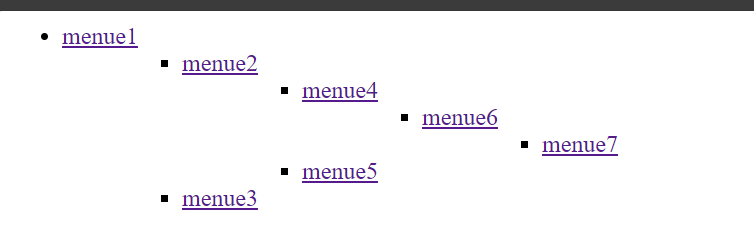

How to run project

1. Apply migrations

```shell
python manage.py migrate
```

2. create superuser

```shell
python manage.py createsuper
```
3. run project
````shell
python manage.py runserver
````
4. create menu items (menu title must be in path)

Example:



| title   | url                                | 
|---------|------------------------------------|
| menue1  | menue1                             | 
| menue2  | menue1/menue2                      |
| menue3  | menue1/menue3                      |
| menue4" | menue1/menue2/menue4               |
| menue5  | menue1/menue2/menue5               |
| menue6  | menue1/menue2/menue4/menue6        |
| menue7  | menue1/menue2/menue4/menue6/menue7 |


'menue1' is a name of root menu

than you can go to http://127.0.0.1:8000/draw_menu/<your_root_menu_item_name>